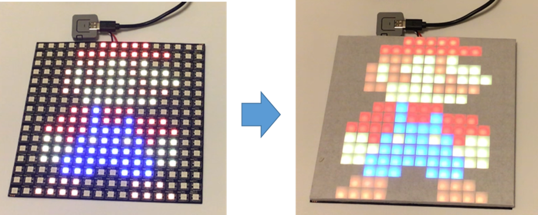
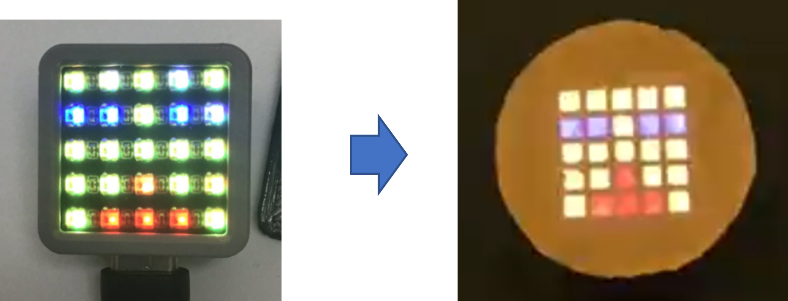
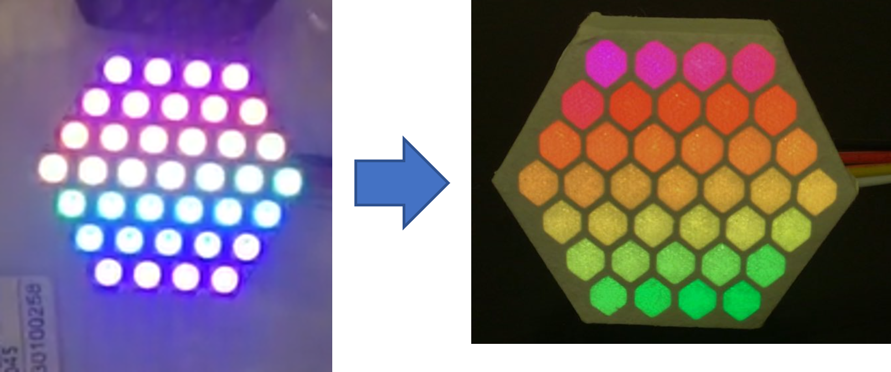
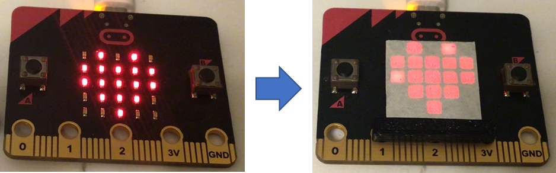
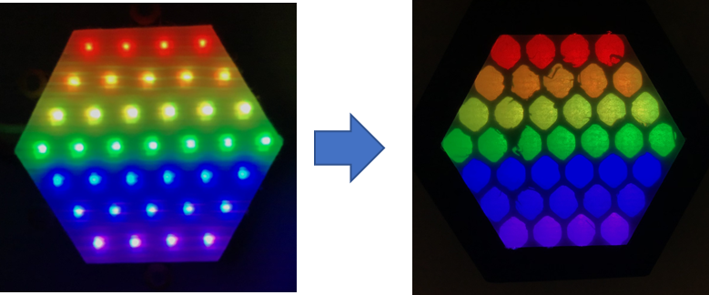
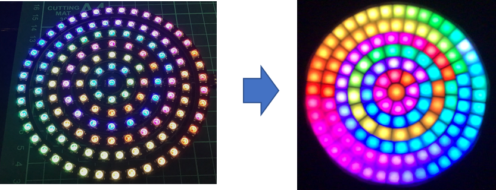

# 3D data of dot picture filter for LED panel

This is just the data for the frame, so please use white paper or plastic for the frame.

***

## 16x16cm LED panel

***  

## M5ATOM Matrix

***
## M5Stack HEX RGB LED Board 

***
## micro:bit

***
## M5Stack Neo HEX 37 RGB LED Board (WS2812)
2022/7/25 add

***
## WS-PCB-CIR-133
2022/10/8 add

